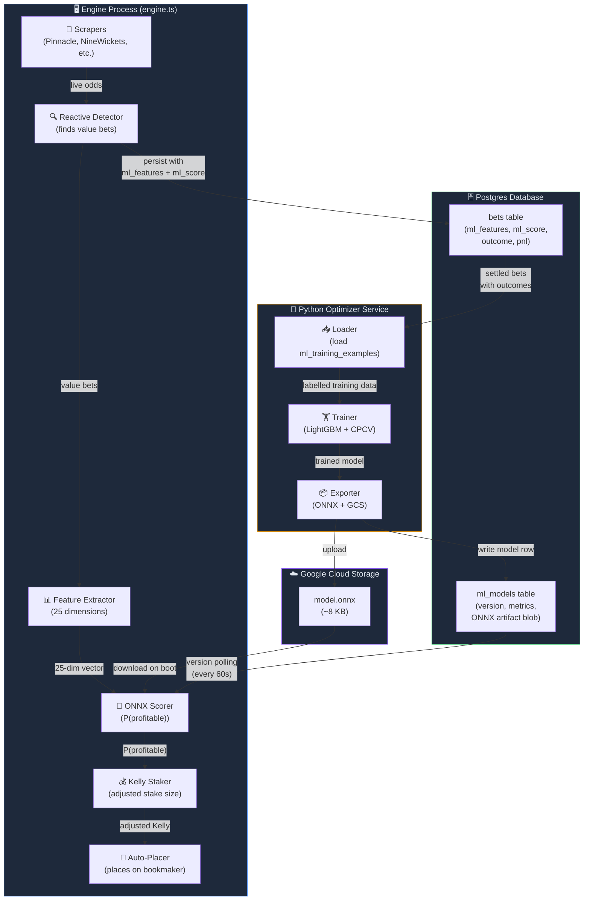
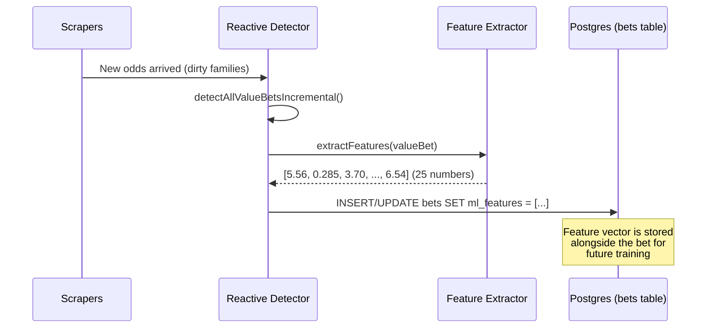
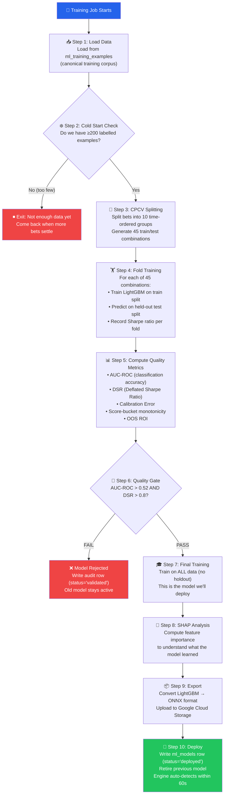
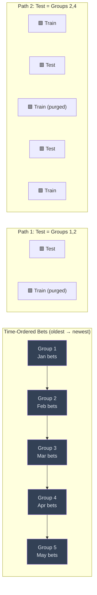
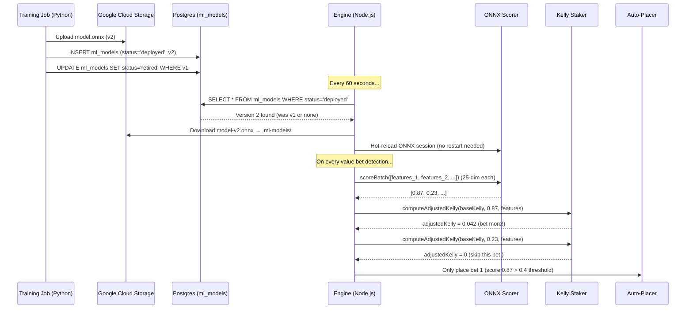
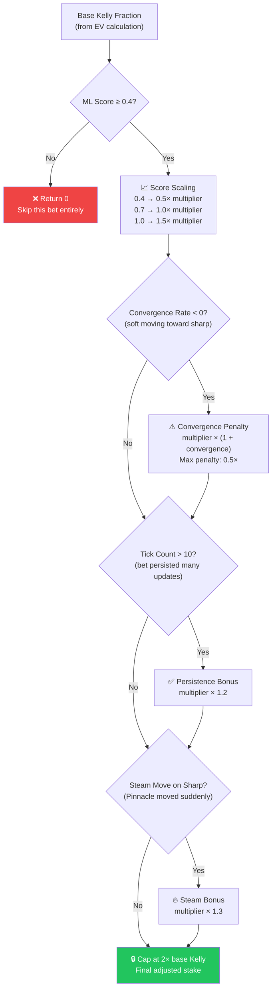
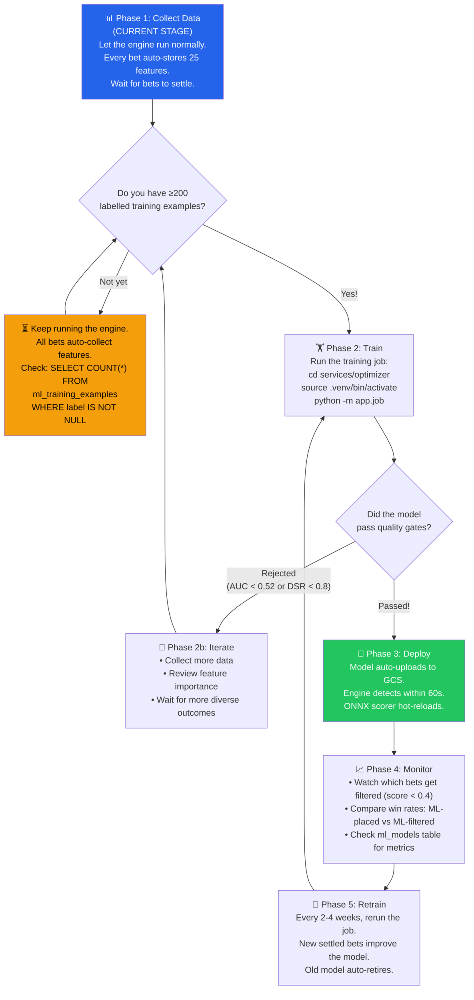
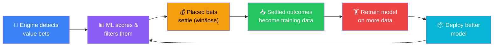

# ML Optimizer — Complete Guide

## What Does the Optimizer Do?

In simple words: **the optimizer learns which value bets actually win and which ones lose, then uses that knowledge to filter and size future bets automatically.**

Without the optimizer, every bet that passes the EV% threshold gets placed with a fixed stake. With the optimizer, a trained ML model scores each bet with a **P(profitable)** confidence score from 0 to 1:

| Score     | Meaning                                       | What Happens                                  |
| --------- | --------------------------------------------- | --------------------------------------------- |
| **0.9**   | "This bet looks very similar to past winners" | Placed with **larger** stake (up to 2× Kelly) |
| **0.6**   | "Decent chance, but some red flags"           | Placed with **normal** stake                  |
| **< 0.4** | "This looks like past losers"                 | **Skipped entirely** — not placed             |

---

## The Big Picture — How Everything Connects



---

## Part 1: How Data is Collected (Automatic)

Every time the engine detects a value bet, it **automatically** computes and stores a 25-dimension feature vector alongside the bet. You don't need to do anything — this happens on every detection pass (~500ms after any odds change).



### What Are the 25 Features?

The features capture **everything the model needs to learn** what makes a winning bet (features 0–20 are the originals, 21–24 were added in the Phase 2–4 pipeline audit):

| #   | Feature                   | Category | What It Captures                                        |
| --- | ------------------------- | -------- | ------------------------------------------------------- |
| 0   | `ev_pct`                  | Value    | How much edge (EV%) this bet has                        |
| 1   | `sharp_true_prob`         | Value    | Pinnacle's vig-removed probability                      |
| 2   | `soft_odds`               | Odds     | Raw soft bookmaker odds                                 |
| 3   | `adjusted_soft_odds`      | Odds     | Soft odds after commission                              |
| 4   | `implied_prob_gap`        | Value    | Gap between sharp and soft implied probability          |
| 5   | `tick_count`              | Movement | How many odds updates recorded (market liquidity)       |
| 6   | `time_to_kickoff_min`     | Market   | Minutes until match starts                              |
| 7   | `movement_pct_sharp`      | Movement | How much sharp odds moved from opening                  |
| 8   | `movement_pct_soft`       | Movement | How much soft odds moved from opening                   |
| 9   | `steam_move_sharp`        | Movement | Binary: sudden sharp movement detected?                 |
| 10  | `steam_move_soft`         | Movement | Binary: sudden soft movement detected?                  |
| 11  | `sharp_direction`         | Movement | Is sharp line going up (+1) or down (-1)?               |
| 12  | `soft_direction`          | Movement | Is soft line going up (+1) or down (-1)?                |
| 13  | `convergence_rate`        | Movement | How fast soft odds are converging toward sharp          |
| 14  | `tick_velocity`           | Movement | Rate of odds updates per minute                         |
| 15  | `provider_count`          | Market   | How many bookmakers offer this market                   |
| 16  | `opening_sharp_odds`      | Odds     | Earliest recorded sharp odds (line origin)              |
| 17  | `market_type_encoded`     | Market   | Market type (Match Result=0, Total Goals=1, AH=2, etc.) |
| 18  | `is_asian_line`           | Market   | Is this a quarter-ball Asian line?                      |
| 19  | `kelly_fraction_raw`      | Staking  | Raw Kelly fraction (optimal stake sizing)               |
| 20  | `vig_pct`                 | Staking  | Sharp bookmaker's overround                             |
| 21  | `competition_tier`        | Market   | Competition quality tier (1=top, 2=mid, 3=low)          |
| 22  | `hours_since_line_opened` | Market   | How long the sharp line has been available              |
| 23  | `sharp_soft_spread`       | Value    | Raw odds gap between soft and implied sharp             |
| 24  | `num_markets_same_event`  | Market   | Active markets on this event (not just value bets)      |

> [!NOTE]
> Features are stored as a JSON array in `bets.ml_features`. After the bet settles (won/lost), a labelled row is written to `ml_training_examples` — the canonical deduplicated training corpus. The features are the input, the outcome is the label.

---

## Part 2: How Training Happens

Training runs as a **Cloud Run Job** (or locally via `python -m app.job`). It is NOT automatic — you trigger it manually when you have enough settled bets.

Training data now lives in the `ml_training_examples` table (canonical, deduplicated by `(source_bet_id, example_type)`).

### Training Pipeline — Step by Step



### What is CPCV? (The Secret Sauce Against Overfitting)

Regular cross-validation (like K-Fold) shuffles data randomly — this is **dangerous** for time-series data like betting because future data leaks into the training set. CPCV (Combinatorial Purged Cross-Validation) solves this:



**Key concepts:**

- **10 groups, pick 2 for testing** → C(10,2) = **45 different train/test paths**
- **Purging**: removes training rows that overlap with test events (same match)
- **Embargo**: removes a 1% buffer zone around test boundaries to prevent data leakage
- Result: **45 honest out-of-sample evaluations** instead of the usual 3-5 from walk-forward

### Quality Gates — What They Mean

| Metric                        | Threshold | Plain English                                                                                                               |
| ----------------------------- | --------- | --------------------------------------------------------------------------------------------------------------------------- |
| **AUC-ROC**                   | > 0.52    | "Can the model rank winners above losers better than a coin flip?"                                                          |
| **DSR** (Deflated Sharpe)     | > 0.80    | "After accounting for how many model variants we tried, is the performance still statistically significant? Not just luck?" |
| **Calibration Error**         | (soft)    | "When the model says 70%, do ~70% of bets actually win? Lower is better."                                                   |
| **Score-bucket monotonicity** | (soft)    | "Higher-scored bets should have higher win rates. If not, the model is confused."                                           |

> [!NOTE]
> PBO (Probability of Backtest Overfitting) is computed and logged for audit purposes, but is **not** a hard deployment gate. With the current single-trial setup, PBO always returns 0.0 and is meaningless.

> [!IMPORTANT]
> If the hard gates fail, the model is **rejected** — it gets recorded in `ml_models` with `status='rejected'` for audit purposes, but the previous deployed model stays active. No bad model can accidentally go live.

---

## Part 3: What Happens After Training

Once a model passes quality gates and gets deployed, a chain of automatic events kicks in:



### The ML Scoring Pipeline in the Engine

Every 500ms when new odds arrive, this happens **automatically** inside the Reactive Detector (features are re-extracted for all live bets each pass to keep time-moving signals fresh):

```
Odds change detected (or periodic rescore tick)
    ↓
detectAllValueBetsIncremental()    →  finds value bets
    ↓
extractFeatures(bet)               →  [5.56, 0.285, 3.70, ..., 6.54] (25-dim)
    ↓
scoreBatch(featureVectors)         →  [0.87, 0.23, 0.91, ...]
    ↓
computeAdjustedKelly(kelly, score) →  dynamic stake sizing
    ↓
maybeAutoPlace(bet, score, kelly)  →  only if score ≥ 0.4
    ↓
persistValueBets(enrichedBets)     →  save ml_features, ml_score, ml_kelly to DB
```

### How the Staker Adjusts Your Bet Size

The staker doesn't just use the ML score — it considers **multiple signals** from the feature vector:



---

## Part 4: How to See the Effects

### Before Training (Current State — No Model Deployed)

Without a model, the scorer runs in **pass-through mode**: every bet gets `mlScore = 1.0`, which means:

- ✅ Every value bet that passes EV% threshold gets auto-placed
- ✅ All bets use the same base Kelly fraction
- ✅ Features are still being collected and stored for future training

### After Training (Model Deployed)

You'll see the ML impact in several places:

#### 1. Bets History Table

Each bet row will have:

- **`ml_score`**: The model's P(profitable) prediction (0 to 1)
- **`ml_kelly_adjusted`**: The dynamically adjusted Kelly fraction
- **`ml_features`**: The full 21-dim feature vector (viewable in Feature Inspector)

#### 2. Engine Logs

```
[MLScorer] Model v2 loaded successfully (.ml-models/model-v2.onnx)
[ReactiveDetector] Pass #1234: 5 dirty → 12 value bets (45ms)
```

You'll also see bets being **skipped** when their ML score is below 0.4:

- Before ML: "12 value bets → 12 placed"
- After ML: "12 value bets → 8 placed (4 filtered by ML)"

#### 3. ML Scorer Status (Engine HTTP API)

```json
{
  "modelLoaded": true,
  "modelVersion": 2,
  "featureCount": 21,
  "totalScored": 4521,
  "avgInferenceMs": 0.3,
  "lastInferenceMs": 0.2
}
```

#### 4. ml_models Table

```
id       | version | status   | oos_auc_roc | deflated_sharpe | pbo  | training_samples
---------|---------|----------|-------------|-----------------|------|------------------
01HX...  | 1       | retired  | 0.6842      | 0.8234          | 0.32 | 847
01HY...  | 2       | deployed | 0.7156      | 0.8912          | 0.28 | 1203
```

---

## Part 5: How to Utilize It

### Step-by-Step Usage



### Commands You'll Use

| Action                           | Command                                                                                      |
| -------------------------------- | -------------------------------------------------------------------------------------------- |
| **Check training example count** | `SELECT COUNT(*) FROM ml_training_examples WHERE label IS NOT NULL;`                         |
| **Run training**                 | `cd services/optimizer && uv run python -m app.job`                                          |
| **Check deployed model**         | `SELECT version, status, oos_auc_roc, deflated_sharpe FROM ml_models ORDER BY version DESC;` |
| **Run verification**             | `npx tsx scripts/ml-verify.ts`                                                               |
| **Check model in engine**        | Engine HTTP API → ML scorer status endpoint                                                  |

### What to Look For After Deployment

| Metric                           | Good Sign                                                | Bad Sign                                                                |
| -------------------------------- | -------------------------------------------------------- | ----------------------------------------------------------------------- |
| **Win rate of ML-placed bets**   | Higher than overall win rate                             | Same or lower                                                           |
| **Win rate of ML-filtered bets** | Lower than overall (the model correctly filtered losers) | Higher (model is filtering good bets!)                                  |
| **ROI**                          | Improving over time as more data → better model          | Declining (model may be stale)                                          |
| **Bets filtered ratio**          | 10-30% filtered (removing noise)                         | >60% filtered (model too aggressive) or 0% (model isn't discriminating) |

### The Feedback Loop



> [!TIP]
> **The engine is always collecting data.** Features are stored on every value bet detection. Once 200+ labelled training examples have accumulated (settled bets with outcomes), training can produce a deployable model.

---

## Summary — The Complete Data Flow

```
┌─────────────────────────── REAL-TIME (Engine, every 500ms) ────────────────────────────┐
│                                                                                         │
│  Odds change → Detect value bet → Extract 25 features → Score with ONNX model           │
│                                   → Adjust Kelly stake → Auto-place if score ≥ 0.4      │
│                                   → Persist bet + features + score to DB                 │
│                                                                                         │
└─────────────────────────────────────────────────────────────────────────────────────────┘
                                          │
                                          │ (bets settle over days/weeks)
                                          ▼
┌───────────────────────── TRAINING (Python Job, on-demand) ─────────────────────────────┐
│                                                                                         │
│  Load ml_training_examples → CPCV split (45 paths) → Train LightGBM per fold            │
│  → Compute AUC-ROC + DSR → Quality gate → Train final model on all data                │
│  → Export ONNX → Store blob in ml_models + upload GCS → Engine hot-reloads               │
│                                                                                         │
└─────────────────────────────────────────────────────────────────────────────────────────┘
```

**The model learns from YOUR betting history to optimize YOUR future bets.** The more bets that settle, the smarter it gets.
