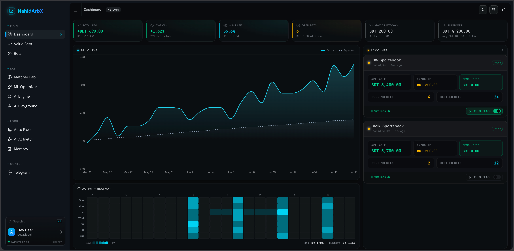
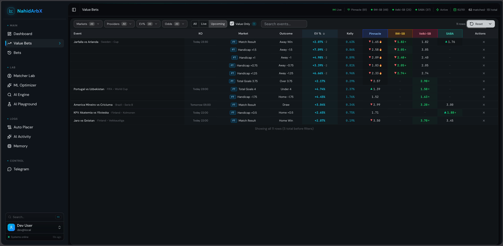
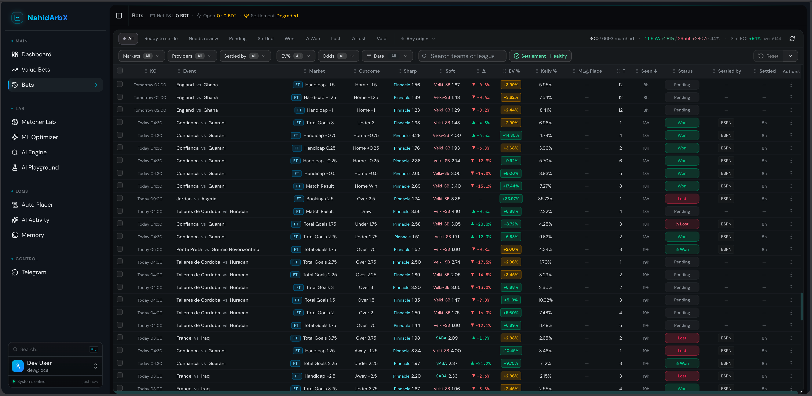
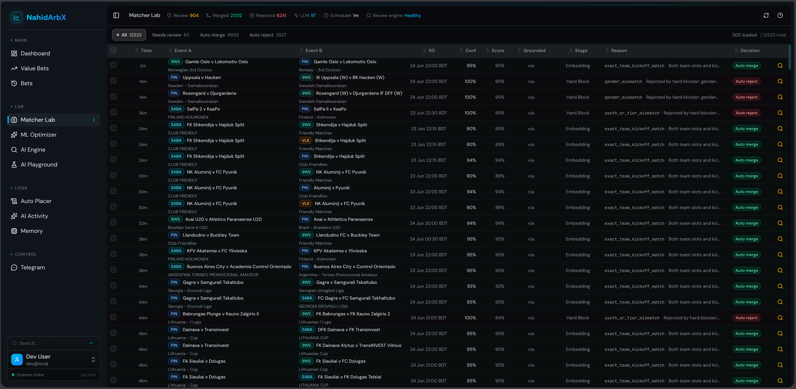
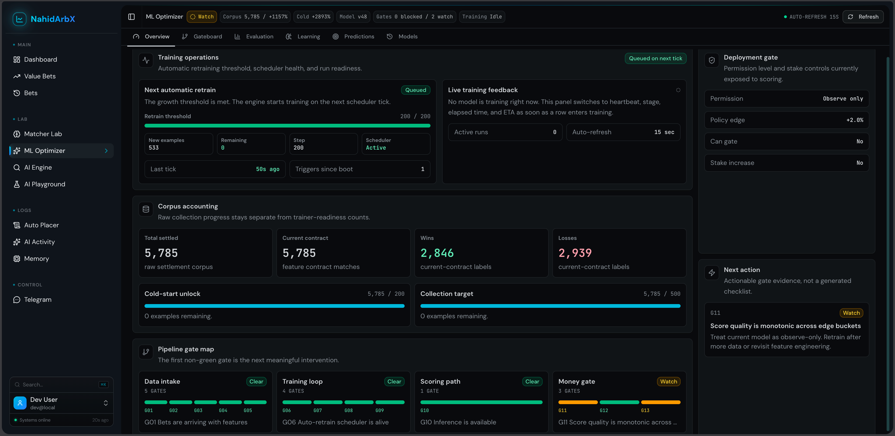

<div align="center">

# NahidArbX

### Real-time sports-market analytics — value-bet detection, settlement ops, and ML-assisted decisioning

A full-stack system that ingests multi-provider odds, matches fixtures across books, flags positive expected-value opportunities against sharp (Pinnacle) prices, and runs the operator loop for placement, settlement, and performance review.

<br />


</div>

---

## Why this exists

Sportsbooks do not share a common language for teams, markets, or prices. Soft books and sharp books diverge constantly. Spotting **mispriced odds** in real time requires more than a scraper: you need reliable cross-provider matching, vig-aware probability, commission-aware EV, durable bet state, and a settlement path you can trust.

NahidArbX is a personal systems project that turns that problem into a working operations platform — not a toy demo of a single formula.

## What it does

| Capability | What you get |
| --- | --- |
| **Multi-provider ingestion** | Fixtures, odds, balances, and session health from soft books plus Pinnacle as the sharp reference |
| **Event matching** | Aligns the same football fixture across providers despite messy team names, competitions, and kickoff surfaces |
| **Market normalization** | Maps provider markets into shared **families** (e.g. 1X2) and **atoms** (e.g. Home Win) so prices compare cleanly |
| **Value-bet detection** | Vig-removed true probability, commission-adjusted soft odds, EV%, and Kelly-style stake sizing — reactive, not poll-only |
| **Operator workflows** | Dashboard, live value-bet surface, bets history, auto-place logs, Telegram controls |
| **Settlement pipeline** | Source-only waterfall (cache → ESPN → SofaScore → API-Football); unresolved rows stay pending for review |
| **Entity resolution** | Postgres alias graph with gates, evidence promotion, and Vertex embeddings for safe auto-confirm |
| **ML loop** | Current-contract training accounting + LightGBM training via Google Cloud Run Jobs |

## Engineering highlights

These are the problems the codebase is really about:

- **Dual-process architecture** — A standalone `engine.ts` owns sync, detection, placement, settlement, and alerts; Next.js serves the UI and thin API proxies. Background work never lives in the web boot path.
- **Reactive detection** — Odds updates flow fixture → match → market atoms → value detection with debounce, so the UI stays close to the market without thrashing.
- **Hard matching policy** — Exact kickoff and hard blockers first; embeddings and optional grounded review only after deterministic gates. Obvious matches auto-resolve; ambiguity stays for humans.
- **Deterministic settlement** — No “let the LLM decide the score.” AI assists operators with prompts and analysis; outcomes come from score sources.
- **Managed ML on Google Cloud** — Training and embeddings stay on Cloud Run / Vertex / GCS, with shared accounting so corpus progress is not hand-waved in the UI.
- **Provider reality** — Playwright-backed Cloudflare bridges, session files, adapter registries, and Zod validation at external boundaries.

## Architecture

```text
     Soft books + Pinnacle (sharp)
     NineWickets / Velki / SABA / BetConstruct
                    │
                    ▼
           Background Engine
   sync · match · atoms · EV detect
   place · settle · notify · retain
                    │
                    ▼
          Cloud SQL (Postgres)
   events · odds · bets · entities · ML
                    │
                    ▼
            Next.js dashboard
   value bets · settlement · matcher lab · ML lab
```

**Core EV idea (simplified):**

```text
trueProb     = vig-removed Pinnacle probability
adjustedOdds = soft odds after commission
evPct        = (adjustedOdds × trueProb − 1) × 100
```

Flag when sharp + soft prices are fresh and `evPct` clears the minimum threshold.

## Screenshots

### Dashboard



### Value-Bet Finder



### Bets History and Settlement



### Matcher Lab



### ML Optimizer



## How this was built

NahidArbX was designed and implemented **end-to-end with AI coding agents as the primary implementation surface** — under continuous human direction for product decisions, architecture, risk rules, and verification.

That is not “generate a starter and ship.” The repo encodes how agents are allowed to work:

| Artifact | Role |
| --- | --- |
| [`AGENTS.md`](./AGENTS.md) / [`CLAUDE.md`](./CLAUDE.md) | Single agent operating contract (symlinks into shared config) |
| [`.central-agent-config/agent-instruction.md`](./.central-agent-config/agent-instruction.md) | Canonical rules: dual-process runtime, settlement safety, UI standards, verification gates |
| [`.central-agent-config/skills/`](./.central-agent-config/skills/) | Domain skills (matcher auto-resolve, settlement review, aggressive cleanup) |
| [`.central-agent-config/mcp/`](./.central-agent-config/mcp/) | Project-scoped MCP (e.g. Cloud SQL-backed Postgres tools for agents) |

**How the loop worked in practice**

1. **Human sets the constraint** — architecture choices, non-negotiables (no settlement AI auto-apply, Tailwind-only UI, managed GCP ML, etc.).
2. **Agents implement under contract** — every tool reads the same `AGENTS.md` so Claude Code, Codex, Cursor, and others share one source of truth.
3. **Skills encode hard workflows** — e.g. diagnose Matcher Lab “needs review” by pipeline stage, then fix generalized matching — not one-off team name hacks.
4. **Verify, then merge** — build, lint, and unit tests after material changes; dead code cleaned as part of the same work.

If you are evaluating this repo as a hiring signal: the interesting part is not that AI wrote lines of code. It is that the system is large enough (providers, matching, EV, settlement, ML, ops UI) that **agent orchestration, domain skills, and architectural guardrails** had to be engineered as first-class artifacts.

## Tech stack

| Layer | Choices |
| --- | --- |
| **UI** | Next.js 16, React 19, TypeScript, Tailwind, Radix |
| **Data UI** | TanStack Query / Table / Virtual, Recharts |
| **Runtime** | Node.js, `tsx` engine process, SSE for live updates |
| **Data** | PostgreSQL on Cloud SQL, Drizzle ORM, Zod |
| **Integrations** | Playwright sessions, provider adapters, Telegram |
| **ML / cloud** | Cloud Run Jobs, Cloud Storage, Vertex AI, LightGBM |
| **Quality** | ESLint, Next production build, Node test runner, Vitest |

## Local development

One root `.env` holds secrets (not committed). Session files under `sessions/` are gitignored.

```bash
npm install
npm run dev:all    # engine + Next.js
```

| Service | Default |
| --- | --- |
| Dashboard | `http://localhost:3000` |
| Engine API | `http://localhost:3001` |

```bash
npm run build && npm run lint
npm run test:unit
npx vitest run
```

Provider access is account- and jurisdiction-sensitive. A public hosted demo is not available; local walkthrough or screenshots on request.

## Scope and responsible use

Personal technical case study for architecture, data pipelines, automation, and operator tooling — **not** a commercial bookmaker, betting tip service, or invitation to wager.

- No credentials or live sessions ship in this repository.
- Reviewers should not need real-money accounts to understand the system.
- Anyone running or adapting the code is responsible for local laws, provider terms, and platform policies.

---

Built as a solo systems project with AI agents under versioned project rules. See [How this was built](#how-this-was-built).
