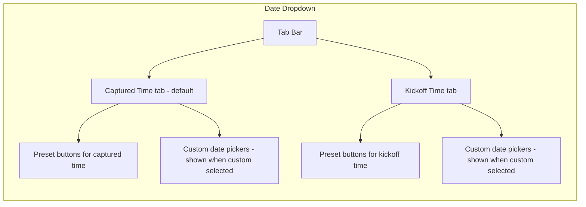

# Bets History — Rename + Dual Date Preset Quick-Select

## Summary

1. Rename the "Backtest" page title to "Bets" (sidebar label stays "Bets").
2. Replace the raw date `<Input type="date">` pickers with a user-friendly dropdown offering preset date ranges (Today, Yesterday, Last 7 Days, etc.) plus a Custom option.
3. Add a **second date dimension** — filter by **event kickoff time** (`eventStartTime`) in addition to the existing **captured time** (`firstSeenAt`). Both filters are applied together with AND logic.

---

## 1. Rename "Backtest" → "Bets"

### Files to change

| File                                        | Current                                                          | New                                                    |
| ------------------------------------------- | ---------------------------------------------------------------- | ------------------------------------------------------ |
| [`app/bets/page.tsx`](app/bets/page.tsx:10) | `title="Backtest"`                                               | `title="Bets"`                                         |
| [`app/bets/page.tsx`](app/bets/page.tsx:13) | `Value-bet spreadsheet · inline outcomes · automatic settlement` | `Bet history · inline outcomes · automatic settlement` |

Sidebar nav label in [`AppShell.tsx`](components/nav/AppShell.tsx:76) already says "Bets" — no change needed.

---

## 2. Dual Date Dimension — Captured Time + Kickoff Time

### 2.1 Why Two Dimensions?

- **Captured time** (`firstSeenAt`) — when the value bet was detected. Useful for reviewing detection activity.
- **Kickoff time** (`eventStartTime`) — when the match starts. Useful for reviewing bets by match day.

Both filters are applied together (AND). Example: "Show bets captured in the last 7 days AND for matches kicking off today."

### 2.2 Server-Side Changes

#### `lib/db/repositories/bets.ts` — `ListFilters` type + `listBets()` query

Add `eventFrom` / `eventTo` fields:

```ts
export type ListFilters = {
  from?: string; // existing — filters firstSeenAt
  to?: string; // existing — filters firstSeenAt
  eventFrom?: string; // NEW — filters eventStartTime
  eventTo?: string; // NEW — filters eventStartTime
  // ... rest unchanged
};
```

In `listBets()`, add:

```ts
if (filters.eventFrom)
  clauses.push(gte(bets.eventStartTime, filters.eventFrom));
if (filters.eventTo) clauses.push(lte(bets.eventStartTime, filters.eventTo));
```

#### `app/api/bets/route.ts` — QuerySchema

Add `eventFrom` / `eventTo` as optional datetime strings:

```ts
const QuerySchema = z.object({
  from: z.string().datetime().optional(),
  to: z.string().datetime().optional(),
  eventFrom: z.string().datetime().optional(), // NEW
  eventTo: z.string().datetime().optional(), // NEW
  // ... rest unchanged
});
```

#### `lib/backtest/api-client.ts` — `ListFilters` type

Add the same two fields to the client-side filter type:

```ts
export type ListFilters = {
  from?: string;
  to?: string;
  eventFrom?: string; // NEW
  eventTo?: string; // NEW
  // ... rest unchanged
};
```

---

## 3. Date Preset Quick-Select Dropdown

### 3.1 Preset Options

Same presets for both dimensions:

| Preset Key  | Label         | `from`               | `to`             |
| ----------- | ------------- | -------------------- | ---------------- |
| `today`     | Today         | start of today       | end of today     |
| `yesterday` | Yesterday     | start of yesterday   | end of yesterday |
| `last3d`    | Last 3 Days   | 3 days ago           | end of today     |
| `last7d`    | Last 7 Days   | 7 days ago           | end of today     |
| `last15d`   | Last 15 Days  | 15 days ago          | end of today     |
| `thisMonth` | This Month    | 1st of current month | end of today     |
| `last30d`   | Last 30 Days  | 30 days ago          | end of today     |
| `last60d`   | Last 2 Months | 60 days ago          | end of today     |
| `last90d`   | Last 3 Months | 90 days ago          | end of today     |
| `all`       | All Time      | —                    | —                |
| `custom`    | Custom…       | user-picked          | user-picked      |

### 3.2 New File: `lib/backtest/date-presets.ts`

Uses **date-fns** (already installed at v4.1.0) for clean date math:

```ts
import { startOfDay, endOfDay, subDays, startOfMonth } from "date-fns";

export type DatePresetKey =
  | "today"
  | "yesterday"
  | "last3d"
  | "last7d"
  | "last15d"
  | "thisMonth"
  | "last30d"
  | "last60d"
  | "last90d"
  | "all"
  | "custom";

export type DatePreset = {
  key: DatePresetKey;
  label: string;
  resolve: () => { from?: string; to?: string };
};

export const DATE_PRESETS: DatePreset[] = [
  /* ... */
];

export function detectPreset(from?: string, to?: string): DatePresetKey {
  /* ... */
}
```

### 3.3 Persist Active Presets in `useBacktestPrefs`

Add `capturedPreset` and `kickoffPreset` fields:

```ts
export type BacktestPrefs = {
  filters: ListFilters;
  sort: { key: SortKey; dir: SortDir };
  capturedPreset?: DatePresetKey; // NEW
  kickoffPreset?: DatePresetKey; // NEW
};
```

On mount, if a non-custom preset is active, resolve it to set the corresponding `from`/`to` or `eventFrom`/`eventTo` in filters.

### 3.4 Updated Toolbar Dropdown UI — Tabbed Design

The date dropdown now has **two tabs** inside it:



**UI behavior:**

1. Dropdown opens with two tabs: **Captured** (default active) and **Kickoff**.
2. Each tab shows the same preset buttons. Clicking a preset immediately sets the corresponding filter and closes the dropdown.
3. Clicking "Custom…" keeps the dropdown open and reveals from/to date inputs below the presets for that tab.
4. The trigger button badge shows both active filters, e.g. `Captured: Last 7 Days · Kickoff: Today`.
5. If only captured filter is active (the common case), badge shows just `Last 7 Days`.
6. If only kickoff filter is active, badge shows `Kickoff: Today`.
7. Both filters are ANDed server-side.

### 3.5 Updated `dateLabel` Logic

```ts
const dateLabel = (() => {
  const capturedPart = (() => {
    if (capturedPreset && capturedPreset !== "custom") {
      return DATE_PRESETS.find((p) => p.key === capturedPreset)?.label;
    }
    const from = filters.from?.slice(0, 10);
    const to = filters.to?.slice(0, 10);
    if (!from && !to) return null;
    if (from && to) return `${from} → ${to}`;
    return from ? `From ${from}` : `Until ${to}`;
  })();

  const kickoffPart = (() => {
    if (kickoffPreset && kickoffPreset !== "custom") {
      return DATE_PRESETS.find((p) => p.key === kickoffPreset)?.label;
    }
    const from = filters.eventFrom?.slice(0, 10);
    const to = filters.eventTo?.slice(0, 10);
    if (!from && !to) return null;
    if (from && to) return `${from} → ${to}`;
    return from ? `From ${from}` : `Until ${to}`;
  })();

  if (capturedPart && kickoffPart)
    return `${capturedPart} · Kickoff: ${kickoffPart}`;
  if (kickoffPart) return `Kickoff: ${kickoffPart}`;
  return capturedPart ?? "All";
})();
```

---

## 4. Files Changed Summary

| #   | File                                      | Change                                                                           |
| --- | ----------------------------------------- | -------------------------------------------------------------------------------- |
| 1   | `app/bets/page.tsx`                       | Rename title "Backtest" → "Bets", update titleBadge                              |
| 2   | `lib/backtest/date-presets.ts`            | **NEW** — preset definitions + resolve + detect helpers using date-fns           |
| 3   | `lib/backtest/api-client.ts`              | Add `eventFrom` / `eventTo` to `ListFilters`                                     |
| 4   | `lib/db/repositories/bets.ts`             | Add `eventFrom` / `eventTo` to `ListFilters` + query clauses                     |
| 5   | `app/api/bets/route.ts`                   | Add `eventFrom` / `eventTo` to `QuerySchema`                                     |
| 6   | `lib/backtest/use-backtest-prefs.ts`      | Add `capturedPreset` / `kickoffPreset` fields                                    |
| 7   | `components/backtest/BacktestToolbar.tsx` | Replace date dropdown with tabbed preset UI + custom pickers, update `dateLabel` |
| 8   | `.roo/rules-architect/AGENTS.md`          | Add pro tip: use date-fns for date filtering                                     |

---

## 5. Pro Tip Memory

> **Pro tip saved**: Use `date-fns` for date filtering. The library is already installed at v4.1.0. Prefer `startOfDay`, `endOfDay`, `subDays`, `startOfMonth` etc. over manual `Date` arithmetic for clarity and correctness.
