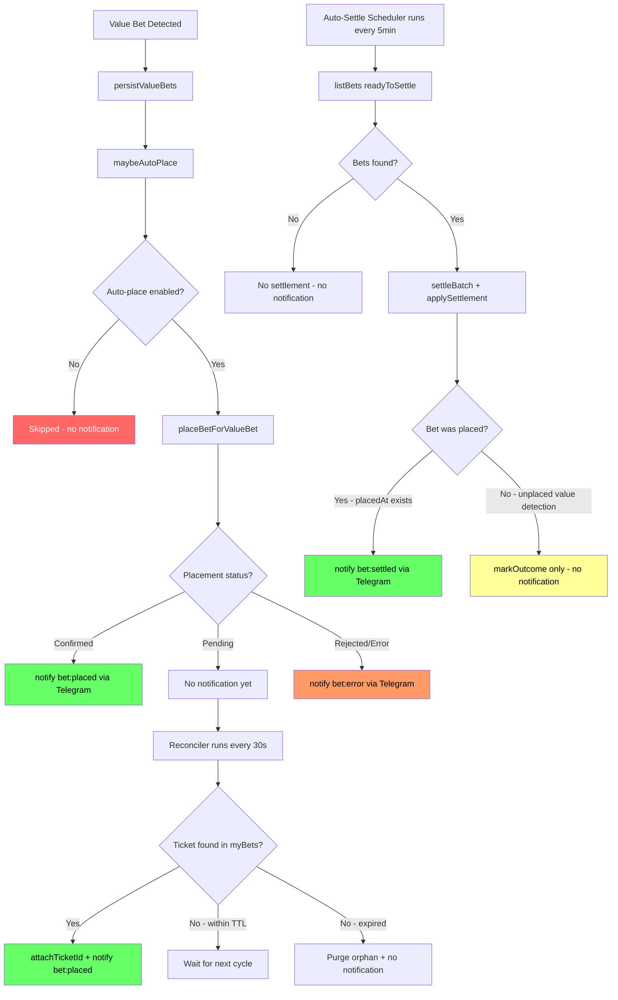

# Telegram Notifications Not Working — Investigation Report

## Summary

Bet placement and settlement notifications are not reaching Telegram. Investigation identified **5 root causes**, ranked by severity.

---

## Root Cause #1 — CRITICAL: Docker missing Telegram env vars

**The most likely cause if you are running in Docker.**

[`docker-compose.yml`](docker-compose.yml:10) only passes these env vars:

- `BETJILI_USERNAME`, `BETJILI_PASSWORD`, `BETJILI_URL`
- `JWT_SECRET`
- `NEXT_PUBLIC_APP_URL`
- `PINNACLE_DAYS_AHEAD`, `PINNACLE_PAGE_SIZE`
- `FETCH_INTERVAL_MS`

**Missing:** `TELEGRAM_BOT_TOKEN` and `TELEGRAM_CHAT_ID` are NOT in the `environment:` block.

Meanwhile, [`.dockerignore`](.dockerignore:12) excludes `.env` files:

```
.env
.env.*
!.env.example
```

So the Docker container never receives the Telegram credentials. In [`lib/notifier/telegram.ts`](lib/notifier/telegram.ts:40), `getCreds()` returns `null` and **all notifications are silently skipped** with a one-time warning:

```
TELEGRAM_BOT_TOKEN / TELEGRAM_CHAT_ID not set; notifications disabled
```

### Fix

Add to `docker-compose.yml` environment section:

```yaml
- TELEGRAM_BOT_TOKEN=${TELEGRAM_BOT_TOKEN}
- TELEGRAM_CHAT_ID=${TELEGRAM_CHAT_ID}
```

---

## Root Cause #2 — HIGH: Auto-place toggle OFF by default

[`lib/betting/auto-place-config.ts`](lib/betting/auto-place-config.ts:34) reads from `sessions/betting/auto-place.json`. The `sessions/betting/` directory is **empty** — no config file exists. `isAutoPlaceEnabled()` returns `false` for every provider.

This means [`maybeAutoPlace()`](lib/betting/auto-placer.ts:31) exits immediately for every value bet, so the auto-placement path never fires and no `bet:placed` notification is ever triggered from the sync pipeline.

Manual placements via the UI still work, but if you are expecting auto-placements, this is a blocker.

### Fix

Either:

1. Toggle auto-place ON via the dashboard UI, OR
2. Create `sessions/betting/auto-place.json`:

```json
{
  "enabled": {
    "ninewickets-sportsbook": true
  }
}
```

---

## Root Cause #3 — MEDIUM: Pending placements never confirmed

Most 9W Sportsbook placements return `status: "pending"`. The placer intentionally **skips Telegram** for pending bets ([`lib/betting/placer.ts:574`](lib/betting/placer.ts:574)):

```typescript
// Telegram notify — ONLY on confirmed placements. Pending
// placements (book accepted but still processing) are notified
// later by the reconciler once a matching ticket appears in
// myBets.
if (!isPending) {
  await notify({ type: "bet:placed", ... });
}
```

Confirmation depends on the **reconciler** running every 30s inside the fetcher scheduler ([`lib/background/fetcher.ts:70`](lib/background/fetcher.ts:70)). If the main scheduler is paused or not running, pending bets are never confirmed and never notified.

### Fix

Ensure the main sync scheduler is running. Check via the dashboard or the `/api/health` endpoint.

---

## Root Cause #4 — MEDIUM: Auto-settle scheduler may not be running

Settlement notifications come from [`lib/settle/auto-settler.ts:220`](lib/settle/auto-settler.ts:220) inside `runAutoSettle()`. This is called by the auto-settle scheduler ([`lib/settle/scheduler.ts`](lib/settle/scheduler.ts:1)).

The scheduler may not be running if:

1. **Kill switch is engaged** — [`lib/settle/kill-switch.ts`](lib/settle/kill-switch.ts:14) reads from `sessions/auto-settle-config.json`. If `disabled: true`, the scheduler refuses to start even after a redeploy.
2. **Scheduler never started** — [`instrumentation.ts`](instrumentation.ts:26) starts it on boot, but only if `!isAutoSettleActive() && !isAutoSettleDisabled()`.

### Fix

1. Check kill-switch state via the dashboard or delete `sessions/auto-settle-config.json` if it has `disabled: true`
2. Ensure the auto-settle scheduler is started via the UI or API

---

## Root Cause #5 — LOW: Settlement timing gate

The `readyToSettle` filter in [`lib/db/repositories/bets.ts:225`](lib/db/repositories/bets.ts:225) requires:

```sql
outcome = 'pending' AND eventStartTime <= NOW() - INTERVAL '2 hours 15 minutes'
```

Bets whose matches finished less than 2h15m ago won't be picked up yet. This is by design but can be confusing if you expect immediate settlement after a match ends.

### Fix

This is intentional — the delay allows for score verification. No code change needed, but be aware of the lag.

---

## Notification Flow Diagram



---

## Fix Checklist

1. **Add Telegram env vars to docker-compose.yml** — this is the primary fix
2. **Enable auto-place for ninewickets-sportsbook** — if auto-placement is desired
3. **Verify main sync scheduler is running** — needed for reconciler to confirm pending bets
4. **Verify auto-settle scheduler is running** — needed for settlement notifications
5. **Check kill-switch state** — ensure settlement is not disabled
